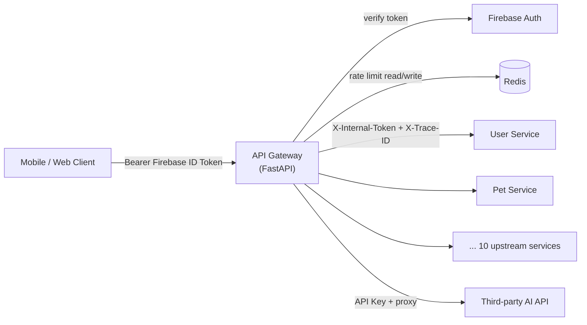
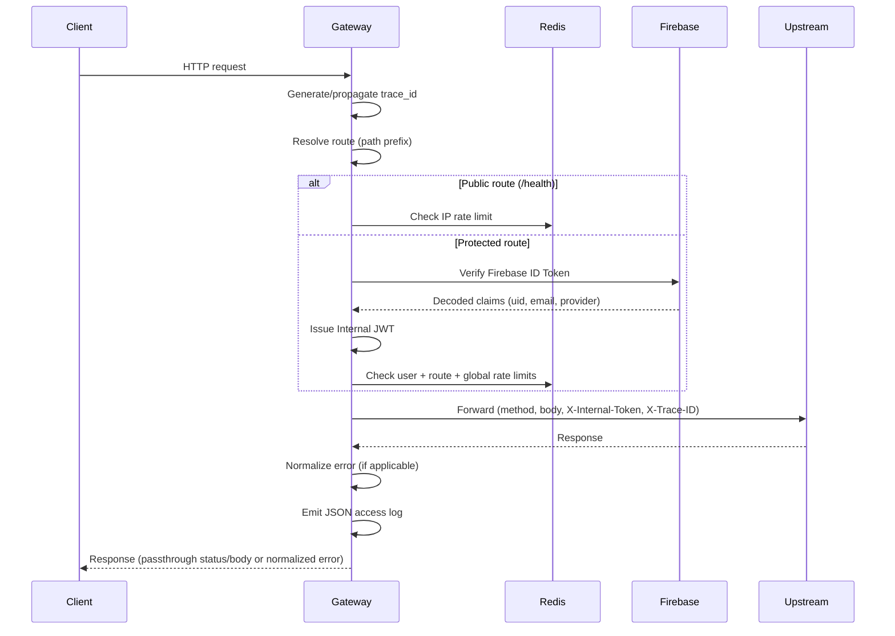
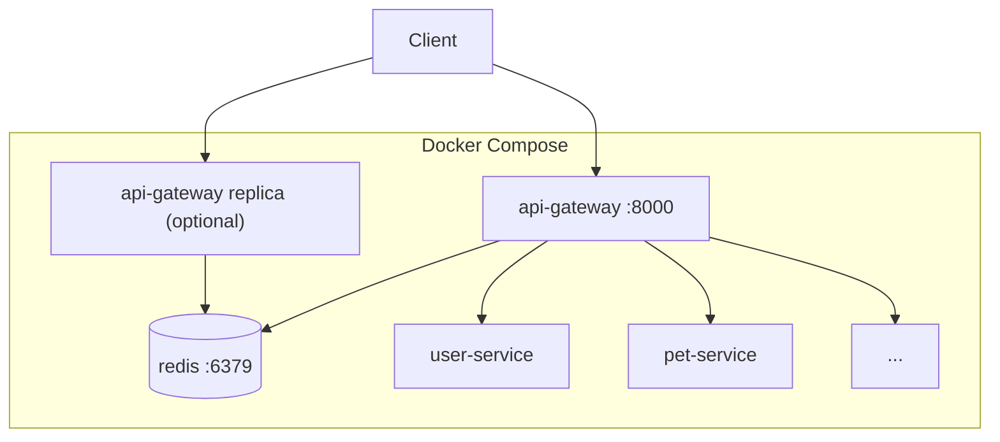
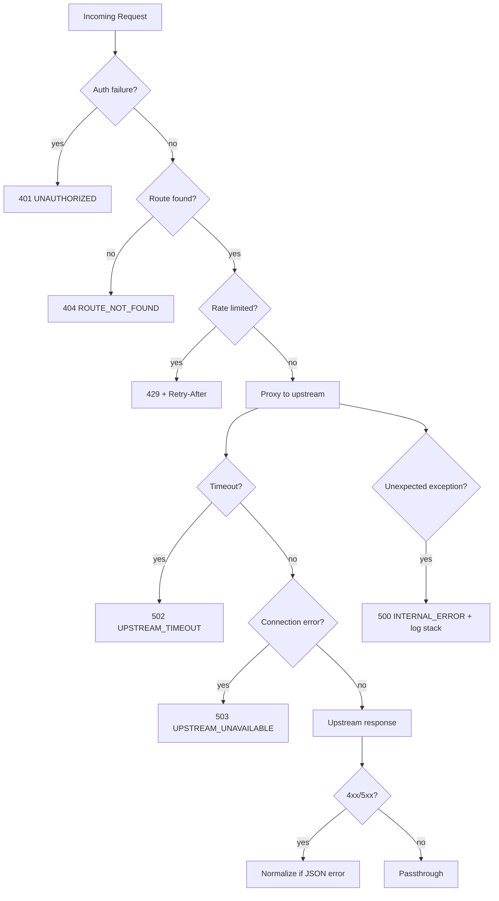

# API Gateway — Design

**Project:** Dokat (mạng xã hội dành cho thú cưng)  
**Feature:** API Gateway  
**Version:** 1.0  
**Date:** 2026-06-15  
**Status:** Approved  
**Stack:** FastAPI · Redis · Docker  

**Requirements:** [requirements.md](./requirements.md)  
**Decisions:** [decision_log.md](./decision_log.md)

---

## Architecture Overview

### Vai trò

API Gateway là **single entry point** HTTP/REST cho mobile/web client. Gateway
**không** chứa business logic của domain services — chỉ xử lý cross-cutting
concerns: auth exchange, routing, rate limiting, logging, error normalization,
health aggregation.

### Stack

| Layer | Công nghệ | Vai trò |
|---|---|---|
| Runtime | Python 3.11+ | Ngôn ngữ chính |
| Web framework | FastAPI | HTTP server, middleware pipeline, async I/O |
| Auth | Firebase Admin SDK | Verify Firebase ID Token |
| Token issuance | PyJWT | Sinh Internal JWT (HS256) |
| HTTP client | httpx (async) | Proxy request đến upstream |
| Rate limiting | Redis 7+ | Sliding window counters (shared khi scale ngang) |
| Container | Docker + Docker Compose | Build & orchestration local/dev |
| Logging | structlog / python-json-logger | JSON stdout → Loki-ready |

### High-level diagram



### Request lifecycle



### Deployment topology (Docker Compose)



Gateway container phụ thuộc: **Redis** (required), **Firebase credentials**
(mounted secret). Upstream URLs cấu hình qua env.

---

## Data Models / Schema

Gateway **không dùng persistent database** — state chỉ qua Redis và env.
Các "model" dưới đây là cấu trúc dữ liệu in-memory, Redis keys, và log/error
payloads.

### Internal JWT Claims

Payload sinh sau khi verify Firebase token thành công.

| Field | Type | Required | Mô tả |
|---|---|---|---|
| `uid` | string | yes | Firebase UID |
| `email` | string \| null | no | Email nếu có (Anonymous thì null) |
| `auth_provider` | string | yes | `anonymous` \| `google.com` \| `facebook.com` \| `apple.com` \| `password` |
| `iat` | int (Unix) | yes | Issued at |
| `exp` | int (Unix) | yes | Expires at (≤ 15 phút sau `iat`) |
| `iss` | string | yes | `"dokat-api-gateway"` |
| `sub` | string | yes | Trùng `uid` |

Header forward (internal upstream): `X-Internal-Token: Bearer <internal_jwt>`

Firebase `Authorization` header **không** được forward đến upstream.

**Trust model:** Gateway là ranh giới xác thực duy nhất. Upstream **không
verify chữ ký JWT** — tin tưởng request đến từ mạng nội bộ và đọc claims
(`uid`, `email`, `auth_provider`) từ payload để biết identity. Internal JWT
dùng HS256 (`JWT_SECRET_KEY`) chỉ để Gateway ký; upstream decode payload
không cần secret.

### Firebase Token → auth_provider mapping

| Firebase `sign_in_provider` | Internal `auth_provider` |
|---|---|
| `anonymous` | `anonymous` |
| `google.com` | `google.com` |
| `facebook.com` | `facebook.com` |
| `apple.com` | `apple.com` |
| Khác | Giá trị provider gốc từ Firebase claims |

### Redis Key Schema (Rate Limiting)

Algorithm: **Sliding window log** (sorted set per key) hoặc **sliding window
counter** (INCR + EXPIRE) — chọn counter-based cho hiệu năng, đủ chính xác
cho limit phút.

| Key pattern | Identifier | Window | Default limit |
|---|---|---|---|
| `rl:user:{uid}` | Firebase UID | 60s | 200 |
| `rl:ip:{ip}` | Client IP | 60s | 30 |
| `rl:route:{uid}:{route_id}` | UID + route | 60s | Per env (Capture: 20) |
| `rl:global` | Global counter | 60s | 10_000 (env) |

TTL mỗi key = window size (60s). Khi vượt limit, tính `Retry-After` = thời
gian còn lại đến khi request cũ nhất rơi khỏi window.

### Access Log Schema (JSON stdout)

Mỗi request một dòng JSON (level INFO cho 2xx/3xx/4xx business, ERROR cho
5xx gateway/upstream failures).

```json
{
  "level": "INFO",
  "timestamp": "2026-06-15T10:00:00.000Z",
  "trace_id": "550e8400-e29b-41d4-a716-446655440000",
  "method": "GET",
  "path": "/pets/123",
  "status_code": 200,
  "latency_ms": 45,
  "upstream_latency_ms": 38,
  "user_id": "firebase-uid-abc",
  "client_ip": "203.0.113.1",
  "upstream": "pet-service",
  "route_id": "pets"
}
```

**Không log:** `Authorization`, Firebase token, Internal JWT payload, request
body chứa secrets.

### Error Response Schema

Chuẩn duy nhất trả về client (FR-05.1):

```json
{
  "error": {
    "code": "STRING_ENUM",
    "message": "Human-readable message",
    "trace_id": "uuid-v4"
  }
}
```

### Health Check Response Schema

```json
{
  "status": "healthy",
  "gateway": "ok",
  "timestamp": "2026-06-15T10:00:00.000Z",
  "upstreams": {
    "user-service": { "status": "up", "latency_ms": 12 },
    "pet-service": { "status": "up", "latency_ms": 8 },
    "onboarding-service": { "status": "down", "latency_ms": null, "error": "connection refused" },
    "capture-service": { "status": "up", "latency_ms": 15 }
  }
}
```

HTTP status: **200** nếu gateway ok và mọi **critical** upstream up; **503**
nếu bất kỳ critical upstream down. Non-critical upstream down vẫn có thể 200
với `status: "degraded"` trong body (optional field).

---

## API Contracts

Gateway expose **một endpoint native** (`GET /health`) và **proxy pass-through**
cho mọi route đã đăng ký. Response body/status từ upstream được trả về nguyên
trạng trừ khi Gateway tự sinh lỗi hoặc normalize upstream error.

### Native endpoints

#### `GET /health`

| | |
|---|---|
| **Auth** | Public (không cần `Authorization`) |
| **Rate limit** | IP-based (30 req/min) |
| **Response 200** | Gateway + tất cả critical upstream healthy |
| **Response 503** | Ít nhất một critical upstream down |

#### `GET /ready` (optional, internal)

| | |
|---|---|
| **Auth** | Public |
| **Purpose** | Kubernetes readiness — chỉ check gateway + Redis |
| **Response 200** | Gateway process ok, Redis reachable |
| **Response 503** | Redis unreachable |

> Ghi chú: FR-06 chỉ yêu cầu `/health`. `/ready` là design decision cho
> K8s tương lai, có thể bỏ nếu muốn strict scope.

### Proxied routes (path prefix → upstream)

Base URL client: `https://api.dokat.app` (env: `GATEWAY_PUBLIC_URL`).

| Path prefix | Upstream env var | Service | Auth | Per-route limit |
|---|---|---|---|---|
| `/users/*` | `UPSTREAM_USER_SERVICE_URL` | User Service | Required | Default user limit |
| `/pets/*` | `UPSTREAM_PET_SERVICE_URL` | Pet Service | Required | Default |
| `/posts/*` | `UPSTREAM_POST_SERVICE_URL` | Post/Feed Service | Required | Default |
| `/feed/*` | `UPSTREAM_POST_SERVICE_URL` | Post/Feed (alias) | Required | Default |
| `/social/*` | `UPSTREAM_SOCIAL_SERVICE_URL` | Social Graph | Required | Default |
| `/capture/*` | `UPSTREAM_CAPTURE_SERVICE_URL` | Capture Service | Required | **20/min/user** |
| `/send/*` | `UPSTREAM_SEND_SERVICE_URL` | Send Service | Required | Default |
| `/view/*` | `UPSTREAM_VIEW_SERVICE_URL` | View Service | Required | Default |
| `/responses/*` | `UPSTREAM_RESPONSE_SERVICE_URL` | Response Service | Required | Default |
| `/history/*` | `UPSTREAM_HISTORY_SERVICE_URL` | History Service | Required | Default |
| `/onboarding/*` | `UPSTREAM_ONBOARDING_SERVICE_URL` | Onboarding Service | Required (incl. Anonymous) | Default |
| `/notifications/*` | `UPSTREAM_NOTIFICATION_SERVICE_URL` | Notification Service | Required | Default |
| `/settings/*` | `UPSTREAM_SETTING_SERVICE_URL` | Setting Service | Required | Default |
| `/ai/*` | `UPSTREAM_AI_API_URL` | Third-party AI | Required | Default — proxy **API Key only** |

**Path stripping:** Gateway forward **full path** đến upstream (upstream nhận
cùng path `/pets/123`). Nếu upstream expect path khác, cấu hình
`STRIP_PREFIX=true` per route qua env — mặc định **không strip**.

### Protected request contract

**Request (client → gateway):**

```http
GET /pets/123 HTTP/1.1
Host: api.dokat.app
Authorization: Bearer <firebase_id_token>
Content-Type: application/json
X-Trace-ID: <optional-uuid-v4>
```

**Forwarded request (gateway → internal upstream):**

```http
GET /pets/123 HTTP/1.1
Host: pet-service:8080
X-Internal-Token: Bearer <internal_jwt>
X-Trace-ID: 550e8400-e29b-41d4-a716-446655440000
Content-Type: application/json

(stripped: Authorization, Host gốc, hop-by-hop headers)
```

**Forwarded request (gateway → `/ai/*` third-party):**

```http
POST /ai/analyze HTTP/1.1
Host: api.ai-provider.com
Authorization: Bearer <AI_API_KEY>
X-Trace-ID: 550e8400-e29b-41d4-a716-446655440000
Content-Type: application/json

(stripped: Firebase Authorization, X-Internal-Token)
```

Gateway vẫn yêu cầu Firebase auth từ client trước khi proxy `/ai/*`, nhưng
chỉ forward **API Key** của provider — không gửi Internal JWT.

**Trace ID:** Nếu client gửi `X-Trace-ID` là UUID v4 hợp lệ thì **giữ nguyên**;
nếu thiếu hoặc invalid thì Gateway sinh mới.

**Client IP:** Lấy trực tiếp từ `request.client.host` (hiện không đứng sau
reverse proxy).

Hop-by-hop headers bị loại: `Connection`, `Keep-Alive`, `Transfer-Encoding`,
`TE`, `Trailer`, `Upgrade`, `Proxy-*`.

### Gateway-generated error responses

| HTTP | `error.code` | Khi nào |
|---|---|---|
| 401 | `UNAUTHORIZED` | Firebase token invalid/expired/revoked, thiếu Bearer |
| 404 | `ROUTE_NOT_FOUND` | Không match path prefix |
| 429 | `RATE_LIMIT_EXCEEDED` | User/IP/route/global limit |
| 502 | `UPSTREAM_TIMEOUT` | Upstream không phản hồi trong timeout |
| 503 | `UPSTREAM_UNAVAILABLE` | Connection refused / DNS fail |
| 500 | `INTERNAL_ERROR` | Lỗi không mong đợi trong Gateway |

**429 response headers:**

```http
HTTP/1.1 429 Too Many Requests
Retry-After: 30
Content-Type: application/json
```

**Example 401:**

```json
{
  "error": {
    "code": "UNAUTHORIZED",
    "message": "Firebase ID token has expired.",
    "trace_id": "550e8400-e29b-41d4-a716-446655440000"
  }
}
```

### Upstream error passthrough / normalization

Upstream services trả lỗi theo format:

```json
{ "error": { "code": "PET_NOT_FOUND", "message": "Pet does not exist." } }
```

| Upstream status | Gateway behavior |
|---|---|
| 2xx, 3xx | Passthrough body + headers (trừ hop-by-hop) |
| 4xx, 5xx JSON đúng schema | Giữ status code; **thêm `trace_id`** vào `error` object |
| 4xx, 5xx JSON sai schema | Giữ status code; wrap: `{ "error": { "code": "UPSTREAM_ERROR", "message": "...", "trace_id" } }` |
| 4xx, 5xx non-JSON | Giữ status code; wrap với message generic + `trace_id` |

---

## Component Breakdown

```
api-gateway/
├── app/
│   ├── main.py                 # FastAPI app factory, lifespan (Redis, Firebase init)
│   ├── config.py               # pydantic-settings: env vars, route table
│   ├── middleware/
│   │   ├── trace.py            # trace_id generate/propagate
│   │   ├── logging.py          # access log JSON emit
│   │   └── rate_limit.py       # Redis rate limit checks
│   ├── auth/
│   │   ├── firebase.py         # verify_id_token via Firebase Admin SDK
│   │   └── jwt_issuer.py       # Internal JWT create (HS256)
│   ├── routing/
│   │   ├── registry.py         # path prefix → upstream config
│   │   └── matcher.py            # longest prefix match
│   ├── proxy/
│   │   ├── client.py             # httpx AsyncClient pool
│   │   ├── forwarder.py          # build upstream request, measure latency
│   │   └── headers.py            # strip/add headers
│   ├── errors/
│   │   ├── codes.py              # error code enum
│   │   ├── handlers.py           # FastAPI exception handlers
│   │   └── normalizer.py         # upstream error → standard format
│   └── health/
│       └── checker.py            # parallel upstream health probes
├── tests/
│   ├── unit/
│   ├── integration/
│   └── conftest.py               # TestClient, fakeredis, mock Firebase
├── Dockerfile
├── docker-compose.yml            # gateway + redis
└── .env.example
```

### Component responsibilities

| Component | Trách nhiệm | Requirements |
|---|---|---|
| **Trace Middleware** | Giữ `trace_id` từ client nếu UUID hợp lệ, else sinh mới | FR-04.2, AC-09 |
| **Logging Middleware** | Ghi access log sau response; ERROR + stack trace cho exception | FR-04.1, FR-04.3–04.5, AC-08 |
| **Auth (Firebase)** | Verify Bearer token; extract uid, email, provider | FR-02.1–02.2, FR-02.6 |
| **JWT Issuer** | Exchange → Internal JWT ≤15 phút | FR-02.3–02.4 |
| **Route Matcher** | Longest prefix match; 404 nếu không khớp | FR-01.1, FR-01.4 |
| **Rate Limiter** | User/IP/route/global limits qua Redis | FR-03.1–03.6, AC-03, AC-04, AC-10 |
| **Proxy Forwarder** | Async forward; timeout; connection error handling | FR-01.3, FR-05.3–05.4, AC-05 |
| **Error Normalizer** | Chuẩn hoá mọi lỗi gateway + upstream | FR-05.1–05.2, FR-05.5 |
| **Health Checker** | Probe gateway deps + upstream `/health` | FR-06.1–06.2, AC-07 |
| **Config** | Load routes, limits, secrets từ env | Technical Constraints |

### Middleware order (outer → inner)

1. Trace ID
2. Access logging (wrap toàn bộ pipeline)
3. Rate limit (sau auth cho user-based limits)
4. Auth (skip public routes)
5. Route match + proxy

---

## Error Handling Strategy

### Phân loại lỗi



### Nguyên tắc

1. **Fail fast:** Auth và rate limit trước khi gọi upstream (AC-02).
2. **Không leak internals:** Client không nhận stack trace (FR-05.5); stack
   chỉ ở log ERROR (FR-04.3).
3. **trace_id everywhere:** Mọi error response có `trace_id` (FR-05.1, AC-09).
4. **Upstream transparency:** Status code gốc được giữ khi upstream trả lỗi
   business (4xx) — Gateway chỉ normalize body format.
5. **Retry-After chính xác:** Tính từ Redis window còn lại, minimum 1 giây
   (FR-03.5).
6. **Firebase errors mapping:**

   | Firebase exception | HTTP | code |
   |---|---|---|
   | Expired token | 401 | `UNAUTHORIZED` |
   | Revoked token | 401 | `UNAUTHORIZED` |
   | Invalid signature | 401 | `UNAUTHORIZED` |
   | Missing header | 401 | `UNAUTHORIZED` |

### Exception handler layers

- **FastAPI HTTPException** → normalized JSON
- **Firebase Admin exceptions** → 401
- **httpx.TimeoutException** → 502
- **httpx.ConnectError** → 503
- **Uncaught Exception** → 500 + full stack in log

---

## Test Strategy

Approach: **TDD** — viết test trước implementation theo Acceptance Criteria
trong requirements.

### Test pyramid

| Layer | Tool | Phạm vi |
|---|---|---|
| Unit | pytest | JWT claims, route matching, header strip, error normalizer, Retry-After calc |
| Integration | pytest + httpx ASGI transport | Middleware pipeline với fakeredis |
| Contract | pytest + respx (mock upstream) | Full request flow qua TestClient |
| E2E (optional) | docker-compose + pytest | Gateway + Redis container thật |

### Test mapping (Requirements → Tests)

| AC | Test file (gợi ý) | Mô tả |
|---|---|---|
| AC-01 | `tests/integration/test_routing.py` | Happy path `/pets/123` → upstream nhận `X-Internal-Token` |
| AC-02 | `tests/integration/test_auth.py` | Expired token → 401, không forward |
| AC-03 | `tests/integration/test_rate_limit_user.py` | 201 requests → 429 + Retry-After |
| AC-04 | `tests/integration/test_rate_limit_ip.py` | 31 public requests → 429 |
| AC-05 | `tests/integration/test_upstream_errors.py` | Mock timeout → 502, no stack in body |
| AC-06 | `tests/integration/test_quick_auth.py` | Anonymous token → `auth_provider=anonymous` |
| AC-07 | `tests/integration/test_health.py` | All critical up → 200; one critical down → 503 |
| AC-08 | `tests/unit/test_logging.py` | Log không chứa Authorization/token |
| AC-09 | `tests/integration/test_tracing.py` | trace_id in log, header, error body |
| AC-10 | `tests/integration/test_rate_limit_route.py` | Capture limit riêng, endpoint khác vẫn ok |

### Mocking strategy

| Dependency | Mock |
|---|---|
| Firebase Admin | Patch `auth.verify_id_token` — return fixture claims |
| Redis | `fakeredis` (unit/integration) hoặc Redis testcontainer (E2E) |
| Upstream HTTP | `respx` mock router per test |
| Time | `freezegun` cho sliding window edge cases |

### CI pipeline (GitHub Actions)

1. `ruff check` + `ruff format --check`
2. `pytest tests/ -v --cov=app --cov-fail-under=80`
3. `docker build` smoke test

### Key test fixtures

- `valid_firebase_token` → uid, email, google.com
- `anonymous_firebase_token` → uid, no email, anonymous
- `expired_firebase_token` → raises Firebase expired exception
- `upstream_pet_service` → respx route `/pets/{id}` returns 200
- `redis_client` → fakeredis async instance

### Performance smoke (non-functional)

Không blocking cho v1, nhưng ghi nhận target: hàng chục nghìn req/min.
Load test script (locust/k6) chạy manual trước release — verify Redis rate
limit consistency với 2+ gateway replicas.

---

## Environment Variables (reference)

| Variable | Required | Default | Mô tả |
|---|---|---|---|
| `FIREBASE_CREDENTIALS_PATH` | yes | — | Path to service account JSON |
| `JWT_SECRET_KEY` | yes | — | HS256 signing secret |
| `JWT_EXPIRY_MINUTES` | no | `15` | Internal JWT TTL |
| `REDIS_URL` | yes | — | `redis://redis:6379/0` |
| `UPSTREAM_*_URL` | yes | — | Base URL từng upstream |
| `UPSTREAM_TIMEOUT_SECONDS` | no | `30` | Proxy timeout |
| `RATE_LIMIT_USER_PER_MIN` | no | `200` | FR-03.1 |
| `RATE_LIMIT_IP_PER_MIN` | no | `30` | FR-03.2 |
| `RATE_LIMIT_GLOBAL_PER_MIN` | no | `10000` | FR-03.4 |
| `RATE_LIMIT_CAPTURE_PER_MIN` | no | `20` | FR-03.3 example |
| `LOG_LEVEL` | no | `INFO` | Logging level |
| `AI_API_KEY` | yes (if /ai enabled) | — | Third-party AI auth (proxy only) |
| `HEALTH_PROBE_TIMEOUT_SECONDS` | no | `5` | Upstream health GET timeout |

---

## Related documents

- [requirements.md](./requirements.md) — functional & non-functional requirements
- [decision_log.md](./decision_log.md) — design decisions đã xác nhận
